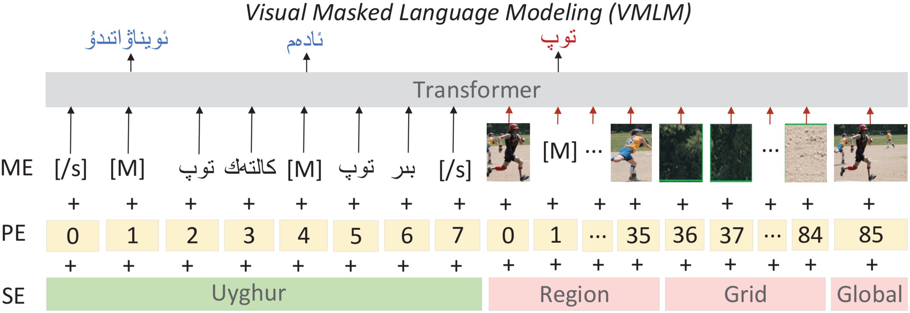

# Low-Resource Machine Translation with Different Granularity Image Features

## VMLM (Visual Masked Language Modeling )



<br>
<br>


## Installation

Install the python package in editable mode with
```bash
pip install -e .
```

## Dependencies

- Python 3
- [NumPy](http://www.numpy.org/)
- [PyTorch](http://pytorch.org/) (currently tested on version 0.4 and 1.0)
- [fastBPE](https://github.com/facebookresearch/XLM/tree/master/tools#fastbpe) (generate and apply BPE codes)
- [Moses](https://github.com/facebookresearch/XLM/tree/master/tools#tokenizers) (scripts to clean and tokenize text only - no installation required)
- [Apex](https://github.com/nvidia/apex#quick-start) (for fp16 training)


## About the Codebase
- The codebase is a revised, improved and extended version of [XLM](https://github.com/facebookresearch/XLM).
- No changes applied to multi-GPU code, which did not work well for us. All models were trained on a single GPU.
- Code portions that are not used are stripped to make the code simpler and clearer.
- Code paths for some of the original XLM tasks such as causal LM, back-translation, auto-encoding, etc.
  are not used/tested and probably broken due to refactoring.
  
 
### Data Preparation
We made some of the datasets and features accessible through [zenodo.org](https://zenodo.org/record/4646961).


### Downloading

Please run `scripts/00-download.sh` from within the `data/` subfolder to download:
- EN-DE corpus for Multi30k dataset and pre-extracted object features

```
$ cd data
$ scripts/00-download.sh
```

### Pre-processing the Corpora
#### Multi30k
After the downloading step, run `scripts/01-process-multi30k.sh` from within the `data/` subfolder
to tokenize and BPE-ize the Multi30k dataset files. The test set in our case here
will refer to `test_2016_flickr` split.

At inference time, you need to manually switch the `test.de-en.*pth` and image order files
to decode other test sets. A hacky think to do is to run the processing script multiple
times to create copies of folders where each folder has a different `test` set.


### Pre-training and Fine-tuning

We provide shell scripts under `scripts/` for pre-training and fine-tuning workflows that are
used throughout the paper. For pre-training the TLM and VMLM, we provide two
toy examples that'll do pre-training on Multi30k as a starting point:

- `mlm.sh`: Trains a MLM model on the Multi30k En-De corpus.
- `vmlm.sh`: Trains a VMLM model on the Multi30k En-De corpus.


#### Train UNMT/UMMT from scratch
You can use `train-[unmt|ummt]-from-scratch.sh` scripts to train UNMT/UMMT
baselines without pre-training / fine-tuning.

#### Fine-tuning VMLM on Multi30k
You can use `ummt-fintune.sh` scripts to fine-tune
existing TLM/VTLM checkpoints on NMT and MMT tasks, using the En-De Multi30k corpus.

#### Decoding NMT/MMT systems
`decode-[nmt|mmt].sh` scripts can be used on arbitrarily trained UNMT/UMMT
checkpoints, to decode translations of `val` and `test_2016_flickr` test set.
By default, it uses a beam size of 8.


## License

See the [LICENSE](LICENSE) file for more details.

